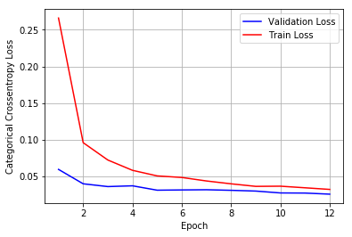
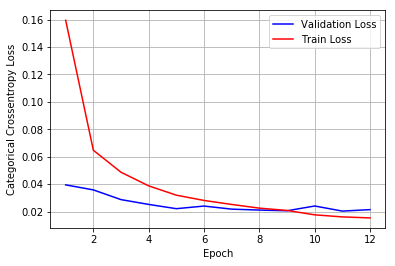
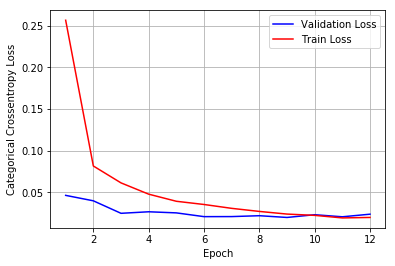

<h1>Convolutional Neural Network -MNIST </h1>


```python
# Credits: https://github.com/keras-team/keras/blob/master/examples/mnist_cnn.py

from __future__ import print_function
import keras
from keras.datasets import mnist
from keras.models import Sequential
from keras.layers import Dense, Dropout, Flatten
from keras.layers import Conv2D, MaxPooling2D,BatchNormalization
from keras import backend as K
import tensorflow as tf
import matplotlib.pyplot as plt
import seaborn as sns
```


```python
# https://gist.github.com/greydanus/f6eee59eaf1d90fcb3b534a25362cea4
# https://stackoverflow.com/a/14434334
# this function is used to update the plots for each epoch and error
def plt_dynamic(x, vy, ty, ax, colors=['b']):
    ax.plot(x, vy, 'b', label="Validation Loss")
    ax.plot(x, ty, 'r', label="Train Loss")
    plt.legend()
    plt.grid()
    fig.canvas.draw()
```


```python
batch_size = 128
num_classes = 10
epochs = 12
```


```python
# input image dimensions
img_rows, img_cols = 28, 28

# the data, split between train and test sets
(x_train, y_train), (x_test, y_test) = mnist.load_data()

if K.image_data_format() == 'channels_first':
    x_train = x_train.reshape(x_train.shape[0], 1, img_rows, img_cols)
    x_test = x_test.reshape(x_test.shape[0], 1, img_rows, img_cols)
    input_shape = (1, img_rows, img_cols)
else:
    x_train = x_train.reshape(x_train.shape[0], img_rows, img_cols, 1)
    x_test = x_test.reshape(x_test.shape[0], img_rows, img_cols, 1)
    input_shape = (img_rows, img_cols, 1)
```


```python
x_train = x_train.astype('float32')
x_test = x_test.astype('float32')
x_train /= 255
x_test /= 255
print('x_train shape:', x_train.shape)
print(x_train.shape[0], 'train samples')
print(x_test.shape[0], 'test samples')
```

    x_train shape: (60000, 28, 28, 1)
    60000 train samples
    10000 test samples
    


```python
# convert class vectors to binary class matrices
y_train = keras.utils.to_categorical(y_train, num_classes)
y_test = keras.utils.to_categorical(y_test, num_classes)
```

<h2> Model 1 </h2>


```python
#Initialising Layers
model = Sequential()

#Convolutional Layer
model.add(Conv2D(64, kernel_size=(3, 3),
                 activation='relu',
                 input_shape=input_shape,
                 kernel_initializer='he_normal'))
#Convolutional Layer
model.add(Conv2D(128, (3, 3), activation='relu',kernel_initializer='he_normal'))
#Maxpooling
model.add(MaxPooling2D(pool_size=(2, 2)))
#Dropout
model.add(Dropout(0.5))
#Flatten
model.add(Flatten())
#Hidden Layer
model.add(Dense(128, activation='relu',kernel_initializer='he_normal'))
#Dropout
model.add(Dropout(0.5))
#Output Layer
model.add(Dense(num_classes, activation=tf.nn.softmax,kernel_initializer='glorot_normal'))

```


```python
#Model Summary
model.summary()
```

    _________________________________________________________________
    Layer (type)                 Output Shape              Param #   
    =================================================================
    conv2d_1 (Conv2D)            (None, 26, 26, 64)        640       
    _________________________________________________________________
    conv2d_2 (Conv2D)            (None, 24, 24, 128)       73856     
    _________________________________________________________________
    max_pooling2d_1 (MaxPooling2 (None, 12, 12, 128)       0         
    _________________________________________________________________
    dropout_1 (Dropout)          (None, 12, 12, 128)       0         
    _________________________________________________________________
    flatten_1 (Flatten)          (None, 18432)             0         
    _________________________________________________________________
    dense_1 (Dense)              (None, 128)               2359424   
    _________________________________________________________________
    dropout_2 (Dropout)          (None, 128)               0         
    _________________________________________________________________
    dense_2 (Dense)              (None, 10)                1290      
    =================================================================
    Total params: 2,435,210
    Trainable params: 2,435,210
    Non-trainable params: 0
    _________________________________________________________________
    


```python
#Compiling
model.compile(loss=keras.losses.categorical_crossentropy,
              optimizer=keras.optimizers.Adadelta(),
              metrics=['accuracy'])

his=model.fit(x_train, y_train,
          batch_size=batch_size,
          epochs=epochs,
          verbose=1,
          validation_data=(x_test, y_test))
```

    Train on 60000 samples, validate on 10000 samples
    Epoch 1/12
    60000/60000 [==============================] - 24s 393us/step - loss: 0.2661 - acc: 0.9199 - val_loss: 0.0593 - val_acc: 0.9821
    Epoch 2/12
    60000/60000 [==============================] - 20s 327us/step - loss: 0.0958 - acc: 0.9722 - val_loss: 0.0396 - val_acc: 0.9862
    Epoch 3/12
    60000/60000 [==============================] - 20s 327us/step - loss: 0.0721 - acc: 0.9783 - val_loss: 0.0358 - val_acc: 0.9886
    Epoch 4/12
    60000/60000 [==============================] - 20s 328us/step - loss: 0.0580 - acc: 0.9828 - val_loss: 0.0369 - val_acc: 0.9894
    Epoch 5/12
    60000/60000 [==============================] - 20s 326us/step - loss: 0.0504 - acc: 0.9855 - val_loss: 0.0309 - val_acc: 0.9902
    Epoch 6/12
    60000/60000 [==============================] - 20s 329us/step - loss: 0.0483 - acc: 0.9854 - val_loss: 0.0312 - val_acc: 0.9900
    Epoch 7/12
    60000/60000 [==============================] - 20s 329us/step - loss: 0.0435 - acc: 0.9869 - val_loss: 0.0315 - val_acc: 0.9912
    Epoch 8/12
    60000/60000 [==============================] - 20s 330us/step - loss: 0.0396 - acc: 0.9879 - val_loss: 0.0307 - val_acc: 0.9903
    Epoch 9/12
    60000/60000 [==============================] - 20s 329us/step - loss: 0.0361 - acc: 0.9889 - val_loss: 0.0297 - val_acc: 0.9912
    Epoch 10/12
    60000/60000 [==============================] - 20s 327us/step - loss: 0.0364 - acc: 0.9896 - val_loss: 0.0271 - val_acc: 0.9909
    Epoch 11/12
    60000/60000 [==============================] - 20s 330us/step - loss: 0.0342 - acc: 0.9895 - val_loss: 0.0270 - val_acc: 0.9918
    Epoch 12/12
    60000/60000 [==============================] - 20s 329us/step - loss: 0.0319 - acc: 0.9907 - val_loss: 0.0255 - val_acc: 0.9914
    


```python
#Plotting the the train and test loss for each epochs

fig,ax = plt.subplots(1,1)
ax.set_xlabel('Epoch') ; ax.set_ylabel('Categorical Crossentropy Loss')

# list of epoch numbers
x = list(range(1,epochs+1))

# print(history.history.keys())
# dict_keys(['val_loss', 'val_acc', 'loss', 'acc'])
# history = model_drop.fit(X_train, Y_train, batch_size=batch_size, epochs=nb_epoch, verbose=1, validation_data=(X_test, Y_test))

# we will get val_loss and val_acc only when you pass the paramter validation_data
# val_loss : validation loss
# val_acc : validation accuracy

# loss : training loss
# acc : train accuracy
# for each key in histrory.histrory we will have a list of length equal to number of epochs

vy = his.history['val_loss']
ty = his.history['loss']
plt_dynamic(x, vy, ty, ax)
```





```python
#Test loss and Accuracy
score = model.evaluate(x_test, y_test, verbose=0)
print('Test loss:', score[0])
print('Test accuracy:', score[1])
```

    Test loss: 0.0254629711212
    Test accuracy: 0.9914
    

<h2> Model 2</h2>


```python
#Initialising Layers
model2 = Sequential()

#Convolutional Layer
model2.add(Conv2D(64, kernel_size=(3, 3),
                 activation='relu',
                 input_shape=input_shape,
                 kernel_initializer='he_normal'))
#Convolutional Layer
model2.add(Conv2D(128, (5, 5), activation='relu',kernel_initializer='he_normal'))
#Maxpooling
model2.add(MaxPooling2D(pool_size=(2, 2)))
#Dropout
model2.add(Dropout(0.5))
#Flatten
model2.add(Flatten())
#Hidden Layer
model2.add(Dense(256, activation='relu',kernel_initializer='he_normal'))
#Batch Normalization
model2.add(BatchNormalization())
#Dropout
model2.add(Dropout(0.5))
#Output Layer
model2.add(Dense(num_classes, activation=tf.nn.softmax,kernel_initializer='glorot_normal'))

```


```python
#Model Summary
model2.summary()
```

    _________________________________________________________________
    Layer (type)                 Output Shape              Param #   
    =================================================================
    conv2d_3 (Conv2D)            (None, 26, 26, 64)        640       
    _________________________________________________________________
    conv2d_4 (Conv2D)            (None, 22, 22, 128)       204928    
    _________________________________________________________________
    max_pooling2d_2 (MaxPooling2 (None, 11, 11, 128)       0         
    _________________________________________________________________
    dropout_3 (Dropout)          (None, 11, 11, 128)       0         
    _________________________________________________________________
    flatten_2 (Flatten)          (None, 15488)             0         
    _________________________________________________________________
    dense_3 (Dense)              (None, 256)               3965184   
    _________________________________________________________________
    batch_normalization_1 (Batch (None, 256)               1024      
    _________________________________________________________________
    dropout_4 (Dropout)          (None, 256)               0         
    _________________________________________________________________
    dense_4 (Dense)              (None, 10)                2570      
    =================================================================
    Total params: 4,174,346
    Trainable params: 4,173,834
    Non-trainable params: 512
    _________________________________________________________________
    


```python
#Compiling
model2.compile(loss=keras.losses.categorical_crossentropy,
              optimizer=keras.optimizers.Adadelta(),
              metrics=['accuracy'])

his=model2.fit(x_train, y_train,
          batch_size=batch_size,
          epochs=epochs,
          verbose=1,
          validation_data=(x_test, y_test))
```

    Train on 60000 samples, validate on 10000 samples
    Epoch 1/12
    60000/60000 [==============================] - 22s 374us/step - loss: 0.1595 - acc: 0.9516 - val_loss: 0.0394 - val_acc: 0.9860
    Epoch 2/12
    60000/60000 [==============================] - 21s 347us/step - loss: 0.0647 - acc: 0.9803 - val_loss: 0.0358 - val_acc: 0.9881
    Epoch 3/12
    60000/60000 [==============================] - 21s 348us/step - loss: 0.0486 - acc: 0.9848 - val_loss: 0.0287 - val_acc: 0.9899
    Epoch 4/12
    60000/60000 [==============================] - 21s 348us/step - loss: 0.0387 - acc: 0.9881 - val_loss: 0.0252 - val_acc: 0.9914
    Epoch 5/12
    60000/60000 [==============================] - 21s 346us/step - loss: 0.0319 - acc: 0.9901 - val_loss: 0.0221 - val_acc: 0.9925
    Epoch 6/12
    60000/60000 [==============================] - 21s 347us/step - loss: 0.0281 - acc: 0.9914 - val_loss: 0.0240 - val_acc: 0.9918
    Epoch 7/12
    60000/60000 [==============================] - 21s 347us/step - loss: 0.0252 - acc: 0.9919 - val_loss: 0.0217 - val_acc: 0.9931
    Epoch 8/12
    60000/60000 [==============================] - 21s 350us/step - loss: 0.0225 - acc: 0.9932 - val_loss: 0.0211 - val_acc: 0.9925
    Epoch 9/12
    60000/60000 [==============================] - 21s 348us/step - loss: 0.0208 - acc: 0.9932 - val_loss: 0.0205 - val_acc: 0.9937
    Epoch 10/12
    60000/60000 [==============================] - 21s 347us/step - loss: 0.0176 - acc: 0.9943 - val_loss: 0.0240 - val_acc: 0.9927
    Epoch 11/12
    60000/60000 [==============================] - 21s 348us/step - loss: 0.0161 - acc: 0.9949 - val_loss: 0.0203 - val_acc: 0.9936
    Epoch 12/12
    60000/60000 [==============================] - 21s 347us/step - loss: 0.0153 - acc: 0.9949 - val_loss: 0.0214 - val_acc: 0.9931
    


```python
#Plotting the the train and test loss for each epochs

fig,ax = plt.subplots(1,1)
ax.set_xlabel('Epoch') ; ax.set_ylabel('Categorical Crossentropy Loss')

# list of epoch numbers
x = list(range(1,epochs+1))

# print(history.history.keys())
# dict_keys(['val_loss', 'val_acc', 'loss', 'acc'])
# history = model_drop.fit(X_train, Y_train, batch_size=batch_size, epochs=nb_epoch, verbose=1, validation_data=(X_test, Y_test))

# we will get val_loss and val_acc only when you pass the paramter validation_data
# val_loss : validation loss
# val_acc : validation accuracy

# loss : training loss
# acc : train accuracy
# for each key in histrory.histrory we will have a list of length equal to number of epochs

vy = his.history['val_loss']
ty = his.history['loss']
plt_dynamic(x, vy, ty, ax)
```





```python
#Test loss and Accuracy
score = model2.evaluate(x_test, y_test, verbose=0)
print('Test loss:', score[0])
print('Test accuracy:', score[1])
```

    Test loss: 0.0213812677467
    Test accuracy: 0.9931
    

<h2> Model 3 </h2>


```python
#Initialising Layers
model3 = Sequential()

#Convolutional Layer
model3.add(Conv2D(64, kernel_size=(5, 5),
                 activation='relu',
                 input_shape=input_shape,
                 kernel_initializer='he_normal'))
#Convolutional Layer
model3.add(Conv2D(128, (7, 7), activation='relu',kernel_initializer='he_normal'))
#Maxpooling
model3.add(MaxPooling2D(pool_size=(2, 2)))
#Dropout
model3.add(Dropout(0.5))
#Flatten
model3.add(Flatten())
#Hidden Layer
model3.add(Dense(256, activation='relu',kernel_initializer='he_normal'))
#Batch Normalization
model3.add(BatchNormalization())
#Dropout
model3.add(Dropout(0.5))
#Hidden Layer 
model3.add(Dense(128,activation='relu',kernel_initializer='he_normal'))
#Batch Normalization
model3.add(BatchNormalization())
#Dropout
model3.add(Dropout(0.5))
#Output Layer
model3.add(Dense(num_classes, activation=tf.nn.softmax,kernel_initializer='glorot_normal'))

```


```python
#Model summary
model3.summary()
```

    _________________________________________________________________
    Layer (type)                 Output Shape              Param #   
    =================================================================
    conv2d_5 (Conv2D)            (None, 24, 24, 64)        1664      
    _________________________________________________________________
    conv2d_6 (Conv2D)            (None, 18, 18, 128)       401536    
    _________________________________________________________________
    max_pooling2d_3 (MaxPooling2 (None, 9, 9, 128)         0         
    _________________________________________________________________
    dropout_5 (Dropout)          (None, 9, 9, 128)         0         
    _________________________________________________________________
    flatten_3 (Flatten)          (None, 10368)             0         
    _________________________________________________________________
    dense_5 (Dense)              (None, 256)               2654464   
    _________________________________________________________________
    batch_normalization_2 (Batch (None, 256)               1024      
    _________________________________________________________________
    dropout_6 (Dropout)          (None, 256)               0         
    _________________________________________________________________
    dense_6 (Dense)              (None, 128)               32896     
    _________________________________________________________________
    batch_normalization_3 (Batch (None, 128)               512       
    _________________________________________________________________
    dropout_7 (Dropout)          (None, 128)               0         
    _________________________________________________________________
    dense_7 (Dense)              (None, 10)                1290      
    =================================================================
    Total params: 3,093,386
    Trainable params: 3,092,618
    Non-trainable params: 768
    _________________________________________________________________
    


```python
#Compiling
model3.compile(loss=keras.losses.categorical_crossentropy,
              optimizer=keras.optimizers.Adadelta(),
              metrics=['accuracy'])

his=model3.fit(x_train, y_train,
          batch_size=batch_size,
          epochs=epochs,
          verbose=1,
          validation_data=(x_test, y_test))
```

    Train on 60000 samples, validate on 10000 samples
    Epoch 1/12
    60000/60000 [==============================] - 22s 361us/step - loss: 0.2565 - acc: 0.9238 - val_loss: 0.0465 - val_acc: 0.9844
    Epoch 2/12
    60000/60000 [==============================] - 20s 325us/step - loss: 0.0817 - acc: 0.9766 - val_loss: 0.0399 - val_acc: 0.9870
    Epoch 3/12
    60000/60000 [==============================] - 20s 327us/step - loss: 0.0614 - acc: 0.9821 - val_loss: 0.0250 - val_acc: 0.9908
    Epoch 4/12
    60000/60000 [==============================] - 20s 327us/step - loss: 0.0479 - acc: 0.9853 - val_loss: 0.0268 - val_acc: 0.9916
    Epoch 5/12
    60000/60000 [==============================] - 20s 326us/step - loss: 0.0394 - acc: 0.9881 - val_loss: 0.0255 - val_acc: 0.9922
    Epoch 6/12
    60000/60000 [==============================] - 19s 324us/step - loss: 0.0355 - acc: 0.9895 - val_loss: 0.0210 - val_acc: 0.9936
    Epoch 7/12
    60000/60000 [==============================] - 20s 327us/step - loss: 0.0309 - acc: 0.9906 - val_loss: 0.0210 - val_acc: 0.9938
    Epoch 8/12
    60000/60000 [==============================] - 20s 325us/step - loss: 0.0272 - acc: 0.9921 - val_loss: 0.0221 - val_acc: 0.9935
    Epoch 9/12
    60000/60000 [==============================] - 19s 324us/step - loss: 0.0240 - acc: 0.9930 - val_loss: 0.0200 - val_acc: 0.9936
    Epoch 10/12
    60000/60000 [==============================] - 19s 325us/step - loss: 0.0225 - acc: 0.9931 - val_loss: 0.0233 - val_acc: 0.9928
    Epoch 11/12
    60000/60000 [==============================] - 19s 325us/step - loss: 0.0194 - acc: 0.9944 - val_loss: 0.0208 - val_acc: 0.9938
    Epoch 12/12
    60000/60000 [==============================] - 20s 326us/step - loss: 0.0200 - acc: 0.9938 - val_loss: 0.0239 - val_acc: 0.9935
    


```python
#Plotting the train and test error for each epochs
fig,ax = plt.subplots(1,1)
ax.set_xlabel('Epoch') ; ax.set_ylabel('Categorical Crossentropy Loss')

# list of epoch numbers
x = list(range(1,epochs+1))

# print(history.history.keys())
# dict_keys(['val_loss', 'val_acc', 'loss', 'acc'])
# history = model_drop.fit(X_train, Y_train, batch_size=batch_size, epochs=nb_epoch, verbose=1, validation_data=(X_test, Y_test))

# we will get val_loss and val_acc only when you pass the paramter validation_data
# val_loss : validation loss
# val_acc : validation accuracy

# loss : training loss
# acc : train accuracy
# for each key in histrory.histrory we will have a list of length equal to number of epochs

vy = his.history['val_loss']
ty = his.history['loss']
plt_dynamic(x, vy, ty, ax)
```





```python
#Test loss and Accuracy
score = model3.evaluate(x_test, y_test, verbose=0)
print('Test loss:', score[0])
print('Test accuracy:', score[1])
```

    Test loss: 0.0239041307543
    Test accuracy: 0.9935
    

<h2> Conclusion : </h2>

<table style="width:100%">
  <tr>
    <th>Model</th>  
    <th>Training Accuracy</th>
    <th>Test Accuracy </th> 
    <th>Train Loss</th>
    <th>Test loss</th>
  </tr>
  <tr>
    <td>1</td>  
    <td>99.07</td>
    <td>99.14</td> 
    <td>0.0319</td>
    <td>0.0255</td> 
  </tr>
  <tr>
    <td>2 </td>  
    <td>99.49</td>
    <td>99.31</td> 
    <td>0.0153</td>
    <td>0.0214</td> 
  </tr>
  <tr>
    <td>3</td>  
    <td>99.38</td>
    <td>99.35</td> 
    <td>0.0200</td>
    <td>0.0239</td> 
  </tr>
</table>
