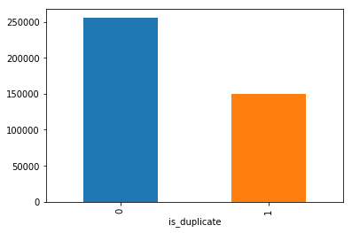
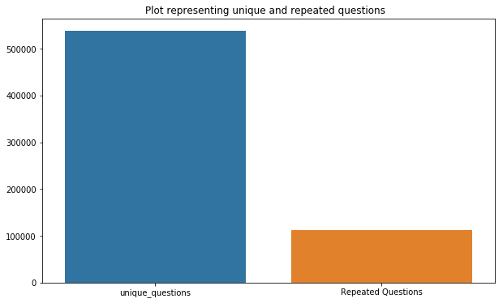
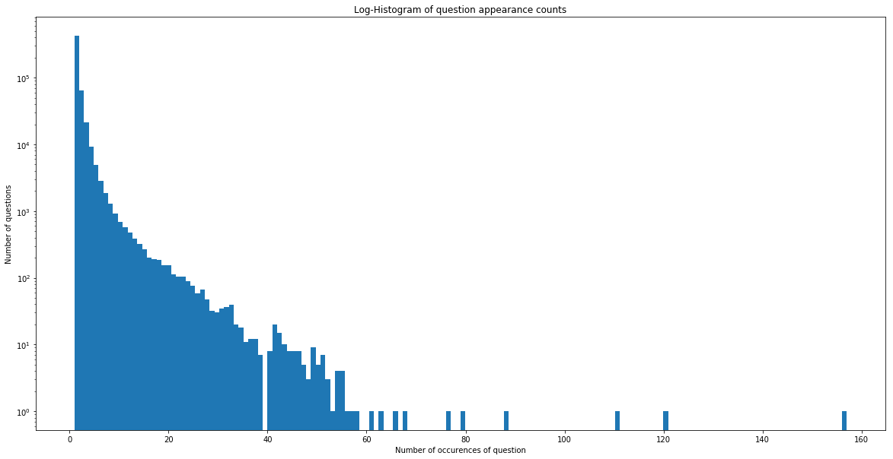
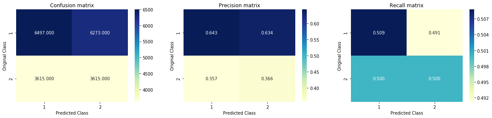
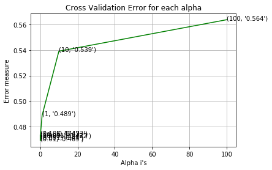
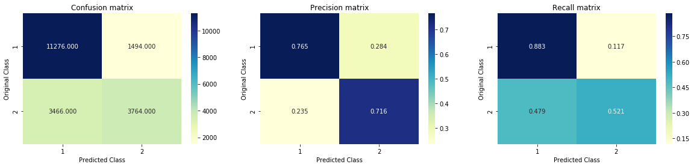
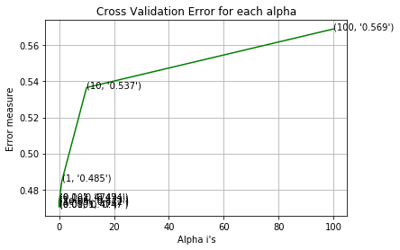

<h1 style="text-align:center;font-size:30px;" > Quora Question Pairs </h1>

<h1> 1. Business Problem </h1>

<h2> 1.1 Description </h2>

<p>Quora is a place to gain and share knowledge—about anything. It’s a platform to ask questions and connect with people who contribute unique insights and quality answers. This empowers people to learn from each other and to better understand the world.</p>
<p>
Over 100 million people visit Quora every month, so it's no surprise that many people ask similarly worded questions. Multiple questions with the same intent can cause seekers to spend more time finding the best answer to their question, and make writers feel they need to answer multiple versions of the same question. Quora values canonical questions because they provide a better experience to active seekers and writers, and offer more value to both of these groups in the long term.
</p>
<br>
> Credits: Kaggle 

- Source : https://www.kaggle.com/c/quora-question-pairs


__ Problem Statement __
- Identify which questions asked on Quora are duplicates of questions that have already been asked. 
- This could be useful to instantly provide answers to questions that have already been answered. 
- We are tasked with predicting whether a pair of questions are duplicates or not. 

<h1>2. Machine Learning Probelm </h1>

<h2> 2.1 Data </h2>

<h3> 2.1.1 Data Overview </h3>

<p> 
- Data will be in a file Train.csv <br>
- Train.csv contains 5 columns : qid1, qid2, question1, question2, is_duplicate <br>
- Size of Train.csv - 60MB <br>
- Number of rows in Train.csv = 404,290
</p>

<h3> 2.1.2 Example Data point </h3>

<pre>
"id","qid1","qid2","question1","question2","is_duplicate"
"0","1","2","What is the step by step guide to invest in share market in india?","What is the step by step guide to invest in share market?","0"
"1","3","4","What is the story of Kohinoor (Koh-i-Noor) Diamond?","What would happen if the Indian government stole the Kohinoor (Koh-i-Noor) diamond back?","0"
"7","15","16","How can I be a good geologist?","What should I do to be a great geologist?","1"
"11","23","24","How do I read and find my YouTube comments?","How can I see all my Youtube comments?","1"
</pre>

<h2> 2.2 Mapping the real world problem to an ML problem </h2>

<h3> 2.2.1 Type of Machine Leaning Problem </h3>

<p> It is a binary classification problem, for a given pair of questions we need to predict if they are duplicate or not. </p>

<h3> 2.2.2 Performance Metric </h3>

Source: https://www.kaggle.com/c/quora-question-pairs#evaluation

Metric(s): 
* log-loss : https://www.kaggle.com/wiki/LogarithmicLoss
* Binary Confusion Matrix

<h2> 2.3 Train and Test Construction </h2>

<p>  </p>
<p> We build train and test by randomly splitting in the ratio of 70:30 or 80:20 whatever we choose as we have sufficient points to work with. </p>

<h1>3. Exploratory Data Analysis </h1>


```python
import numpy as np
import pandas as pd
import seaborn as sns
import matplotlib.pyplot as plt
from subprocess import check_output

import re
import csv
import os
import time
import math
import warnings
from nltk.corpus import stopwords
from nltk.stem import PorterStemmer

import datetime as dt
from sklearn.preprocessing import normalize
from sklearn.feature_extraction.text import CountVectorizer
from sklearn.metrics import confusion_matrix
from sklearn.metrics.classification import accuracy_score, log_loss
from sklearn.feature_extraction.text import TfidfVectorizer
from collections import Counter
from scipy.sparse import hstack
from xgboost import XGBClassifier
from sklearn.model_selection import StratifiedKFold 
from collections import Counter, defaultdict
from sklearn.calibration import CalibratedClassifierCV
from sklearn.model_selection import train_test_split
from sklearn.model_selection import GridSearchCV
from sklearn.metrics import normalized_mutual_info_score
from sklearn.model_selection import cross_val_score
from sklearn.linear_model import SGDClassifier
from sklearn.linear_model import LogisticRegression
from sklearn.metrics import precision_recall_curve, auc, roc_curve
```

<h2> 3.1 Reading data and basic stats </h2>


```python
df = pd.read_csv("train.csv")

print("Number of data points:",df.shape[0])
```

    Number of data points: 404290
    


```python
df.head()
```


<div>
<style scoped>
    .dataframe tbody tr th:only-of-type {
        vertical-align: middle;
    }

    .dataframe tbody tr th {
        vertical-align: top;
    }

    .dataframe thead th {
        text-align: right;
    }
</style>
<table border="1" class="dataframe">
  <thead>
    <tr style="text-align: right;">
      <th></th>
      <th>id</th>
      <th>qid1</th>
      <th>qid2</th>
      <th>question1</th>
      <th>question2</th>
      <th>is_duplicate</th>
    </tr>
  </thead>
  <tbody>
    <tr>
      <th>0</th>
      <td>0</td>
      <td>1</td>
      <td>2</td>
      <td>What is the step by step guide to invest in sh...</td>
      <td>What is the step by step guide to invest in sh...</td>
      <td>0</td>
    </tr>
    <tr>
      <th>1</th>
      <td>1</td>
      <td>3</td>
      <td>4</td>
      <td>What is the story of Kohinoor (Koh-i-Noor) Dia...</td>
      <td>What would happen if the Indian government sto...</td>
      <td>0</td>
    </tr>
    <tr>
      <th>2</th>
      <td>2</td>
      <td>5</td>
      <td>6</td>
      <td>How can I increase the speed of my internet co...</td>
      <td>How can Internet speed be increased by hacking...</td>
      <td>0</td>
    </tr>
    <tr>
      <th>3</th>
      <td>3</td>
      <td>7</td>
      <td>8</td>
      <td>Why am I mentally very lonely? How can I solve...</td>
      <td>Find the remainder when [math]23^{24}[/math] i...</td>
      <td>0</td>
    </tr>
    <tr>
      <th>4</th>
      <td>4</td>
      <td>9</td>
      <td>10</td>
      <td>Which one dissolve in water quikly sugar, salt...</td>
      <td>Which fish would survive in salt water?</td>
      <td>0</td>
    </tr>
  </tbody>
</table>
</div>


```python
df.info()
```

    <class 'pandas.core.frame.DataFrame'>
    RangeIndex: 404290 entries, 0 to 404289
    Data columns (total 6 columns):
    id              404290 non-null int64
    qid1            404290 non-null int64
    qid2            404290 non-null int64
    question1       404289 non-null object
    question2       404288 non-null object
    is_duplicate    404290 non-null int64
    dtypes: int64(4), object(2)
    memory usage: 18.5+ MB
    

We are given a minimal number of data fields here, consisting of:

- id:  Looks like a simple rowID
- qid{1, 2}:  The unique ID of each question in the pair
- question{1, 2}:  The actual textual contents of the questions.
- is_duplicate:  The label that we are trying to predict - whether the two questions are duplicates of each other.

<h3> 3.2.1 Distribution of data points among output classes</h3>
- Number of duplicate(smilar) and non-duplicate(non similar) questions


```python
df.groupby("is_duplicate")['id'].count().plot.bar()
```


    <matplotlib.axes._subplots.AxesSubplot at 0x2156dcabcc0>





```python
print('~> Total number of question pairs for training:\n   {}'.format(len(df)))
```

    ~> Total number of question pairs for training:
       404290
    


```python
print('~> Question pairs are not Similar (is_duplicate = 0):\n   {}%'.format(100 - round(df['is_duplicate'].mean()*100, 2)))
print('\n~> Question pairs are Similar (is_duplicate = 1):\n   {}%'.format(round(df['is_duplicate'].mean()*100, 2)))
```

    ~> Question pairs are not Similar (is_duplicate = 0):
       63.08%
    
    ~> Question pairs are Similar (is_duplicate = 1):
       36.92%
    

<h3> 3.2.2 Number of unique questions </h3>


```python
qids = pd.Series(df['qid1'].tolist() + df['qid2'].tolist())
unique_qs = len(np.unique(qids))
qs_morethan_onetime = np.sum(qids.value_counts() > 1)
print ('Total number of  Unique Questions are: {}\n'.format(unique_qs))
#print len(np.unique(qids))

print ('Number of unique questions that appear more than one time: {} ({}%)\n'.format(qs_morethan_onetime,qs_morethan_onetime/unique_qs*100))

print ('Max number of times a single question is repeated: {}\n'.format(max(qids.value_counts()))) 

q_vals=qids.value_counts()

q_vals=q_vals.values
```

    Total number of  Unique Questions are: 537933
    
    Number of unique questions that appear more than one time: 111780 (20.77953945937505%)
    
    Max number of times a single question is repeated: 157
    
    


```python
x = ["unique_questions" , "Repeated Questions"]
y =  [unique_qs , qs_morethan_onetime]

plt.figure(figsize=(10, 6))
plt.title ("Plot representing unique and repeated questions  ")
sns.barplot(x,y)
plt.show()
```





<h3>3.2.3 Checking for Duplicates </h3>


```python
#checking whether there are any repeated pair of questions

pair_duplicates = df[['qid1','qid2','is_duplicate']].groupby(['qid1','qid2']).count().reset_index()

print ("Number of duplicate questions",(pair_duplicates).shape[0] - df.shape[0])
```

    Number of duplicate questions 0
    

<h3> 3.2.4 Number of occurrences of each question </h3>


```python
plt.figure(figsize=(20, 10))

plt.hist(qids.value_counts(), bins=160)

plt.yscale('log', nonposy='clip')

plt.title('Log-Histogram of question appearance counts')

plt.xlabel('Number of occurences of question')

plt.ylabel('Number of questions')

print ('Maximum number of times a single question is repeated: {}\n'.format(max(qids.value_counts()))) 
```

    Maximum number of times a single question is repeated: 157
    
    





<h3> 3.2.5 Checking for NULL values </h3>


```python
#Checking whether there are any rows with null values
nan_rows = df[df.isnull().any(1)]
print (nan_rows)
```

                id    qid1    qid2                         question1  \
    105780  105780  174363  174364    How can I develop android app?   
    201841  201841  303951  174364  How can I create an Android app?   
    363362  363362  493340  493341                               NaN   
    
                                                    question2  is_duplicate  
    105780                                                NaN             0  
    201841                                                NaN             0  
    363362  My Chinese name is Haichao Yu. What English na...             0  
    

- There are two rows with null values in question2 


```python
# Filling the null values with ' '
df = df.fillna('')
nan_rows = df[df.isnull().any(1)]
print (nan_rows)
```

    Empty DataFrame
    Columns: [id, qid1, qid2, question1, question2, is_duplicate]
    Index: []
    

<h2>3.3 Basic Feature Extraction </h2>

Let us now construct a few features like:
 - ____freq_qid1____ = Frequency of qid1's
 - ____freq_qid2____ = Frequency of qid2's 
 - ____q1len____ = Length of q1
 - ____q2len____ = Length of q2
 - ____q1_n_words____ = Number of words in Question 1
 - ____q2_n_words____ = Number of words in Question 2
 - ____word_Common____ = (Number of common unique words in Question 1 and Question 2)
 - ____word_Total____ =(Total num of words in Question 1 + Total num of words in Question 2)
 - ____word_share____ = (word_common)/(word_Total)
 - ____freq_q1+freq_q2____ = sum total of frequency of qid1 and qid2 
 - ____freq_q1-freq_q2____ = absolute difference of frequency of qid1 and qid2 


```python
#Basic Feature Engineering

df['freq_qid1'] = df.groupby('qid1')['qid1'].transform('count') 
df['freq_qid2'] = df.groupby('qid2')['qid2'].transform('count')
df['q1len'] = df['question1'].str.len() 
df['q2len'] = df['question2'].str.len()
df['q1_n_words'] = df['question1'].apply(lambda row: len(row.split(" ")))
df['q2_n_words'] = df['question2'].apply(lambda row: len(row.split(" ")))

def normalized_word_Common(row):
    w1 = set(map(lambda word: word.lower().strip(), row['question1'].split(" ")))
    w2 = set(map(lambda word: word.lower().strip(), row['question2'].split(" ")))    
    return 1.0 * len(w1 & w2)
df['word_Common'] = df.apply(normalized_word_Common, axis=1)

def normalized_word_Total(row):
    w1 = set(map(lambda word: word.lower().strip(), row['question1'].split(" ")))
    w2 = set(map(lambda word: word.lower().strip(), row['question2'].split(" ")))    
    return 1.0 * (len(w1) + len(w2))
df['word_Total'] = df.apply(normalized_word_Total, axis=1)

def normalized_word_share(row):
    w1 = set(map(lambda word: word.lower().strip(), row['question1'].split(" ")))
    w2 = set(map(lambda word: word.lower().strip(), row['question2'].split(" ")))    
    return 1.0 * len(w1 & w2)/(len(w1) + len(w2))
df['word_share'] = df.apply(normalized_word_share, axis=1)

df['freq_q1+q2'] = df['freq_qid1']+df['freq_qid2']
df['freq_q1-q2'] = abs(df['freq_qid1']-df['freq_qid2'])


df.head()
```


<div>
<style scoped>
    .dataframe tbody tr th:only-of-type {
        vertical-align: middle;
    }

    .dataframe tbody tr th {
        vertical-align: top;
    }

    .dataframe thead th {
        text-align: right;
    }
</style>
<table border="1" class="dataframe">
  <thead>
    <tr style="text-align: right;">
      <th></th>
      <th>id</th>
      <th>qid1</th>
      <th>qid2</th>
      <th>question1</th>
      <th>question2</th>
      <th>is_duplicate</th>
      <th>freq_qid1</th>
      <th>freq_qid2</th>
      <th>q1len</th>
      <th>q2len</th>
      <th>q1_n_words</th>
      <th>q2_n_words</th>
      <th>word_Common</th>
      <th>word_Total</th>
      <th>word_share</th>
      <th>freq_q1+q2</th>
      <th>freq_q1-q2</th>
    </tr>
  </thead>
  <tbody>
    <tr>
      <th>0</th>
      <td>0</td>
      <td>1</td>
      <td>2</td>
      <td>What is the step by step guide to invest in sh...</td>
      <td>What is the step by step guide to invest in sh...</td>
      <td>0</td>
      <td>1</td>
      <td>1</td>
      <td>66</td>
      <td>57</td>
      <td>14</td>
      <td>12</td>
      <td>10.0</td>
      <td>23.0</td>
      <td>0.434783</td>
      <td>2</td>
      <td>0</td>
    </tr>
    <tr>
      <th>1</th>
      <td>1</td>
      <td>3</td>
      <td>4</td>
      <td>What is the story of Kohinoor (Koh-i-Noor) Dia...</td>
      <td>What would happen if the Indian government sto...</td>
      <td>0</td>
      <td>4</td>
      <td>1</td>
      <td>51</td>
      <td>88</td>
      <td>8</td>
      <td>13</td>
      <td>4.0</td>
      <td>20.0</td>
      <td>0.200000</td>
      <td>5</td>
      <td>3</td>
    </tr>
    <tr>
      <th>2</th>
      <td>2</td>
      <td>5</td>
      <td>6</td>
      <td>How can I increase the speed of my internet co...</td>
      <td>How can Internet speed be increased by hacking...</td>
      <td>0</td>
      <td>1</td>
      <td>1</td>
      <td>73</td>
      <td>59</td>
      <td>14</td>
      <td>10</td>
      <td>4.0</td>
      <td>24.0</td>
      <td>0.166667</td>
      <td>2</td>
      <td>0</td>
    </tr>
    <tr>
      <th>3</th>
      <td>3</td>
      <td>7</td>
      <td>8</td>
      <td>Why am I mentally very lonely? How can I solve...</td>
      <td>Find the remainder when [math]23^{24}[/math] i...</td>
      <td>0</td>
      <td>1</td>
      <td>1</td>
      <td>50</td>
      <td>65</td>
      <td>11</td>
      <td>9</td>
      <td>0.0</td>
      <td>19.0</td>
      <td>0.000000</td>
      <td>2</td>
      <td>0</td>
    </tr>
    <tr>
      <th>4</th>
      <td>4</td>
      <td>9</td>
      <td>10</td>
      <td>Which one dissolve in water quikly sugar, salt...</td>
      <td>Which fish would survive in salt water?</td>
      <td>0</td>
      <td>3</td>
      <td>1</td>
      <td>76</td>
      <td>39</td>
      <td>13</td>
      <td>7</td>
      <td>2.0</td>
      <td>20.0</td>
      <td>0.100000</td>
      <td>4</td>
      <td>2</td>
    </tr>
  </tbody>
</table>
</div>


<h2> 3.4 Taking Only 100K samples for analysis </h2>


```python
#Taking only 100k samples
df=df.tail(100000)
df.head(5)
```


<div>
<style scoped>
    .dataframe tbody tr th:only-of-type {
        vertical-align: middle;
    }

    .dataframe tbody tr th {
        vertical-align: top;
    }

    .dataframe thead th {
        text-align: right;
    }
</style>
<table border="1" class="dataframe">
  <thead>
    <tr style="text-align: right;">
      <th></th>
      <th>id</th>
      <th>qid1</th>
      <th>qid2</th>
      <th>question1</th>
      <th>question2</th>
      <th>is_duplicate</th>
      <th>freq_qid1</th>
      <th>freq_qid2</th>
      <th>q1len</th>
      <th>q2len</th>
      <th>q1_n_words</th>
      <th>q2_n_words</th>
      <th>word_Common</th>
      <th>word_Total</th>
      <th>word_share</th>
      <th>freq_q1+q2</th>
      <th>freq_q1-q2</th>
    </tr>
  </thead>
  <tbody>
    <tr>
      <th>304290</th>
      <td>304290</td>
      <td>398995</td>
      <td>427531</td>
      <td>How was your first night after wedding?</td>
      <td>How should a married couple enjoy the first ni...</td>
      <td>0</td>
      <td>1</td>
      <td>1</td>
      <td>39</td>
      <td>50</td>
      <td>7</td>
      <td>9</td>
      <td>2.0</td>
      <td>16.0</td>
      <td>0.125000</td>
      <td>2</td>
      <td>0</td>
    </tr>
    <tr>
      <th>304291</th>
      <td>304291</td>
      <td>427532</td>
      <td>427533</td>
      <td>What is the average number of lines of code wr...</td>
      <td>How long would it take an average programmer t...</td>
      <td>0</td>
      <td>1</td>
      <td>1</td>
      <td>73</td>
      <td>73</td>
      <td>15</td>
      <td>14</td>
      <td>3.0</td>
      <td>28.0</td>
      <td>0.107143</td>
      <td>2</td>
      <td>0</td>
    </tr>
    <tr>
      <th>304292</th>
      <td>304292</td>
      <td>205276</td>
      <td>121216</td>
      <td>How can we prevent rapes in Delhi?</td>
      <td>Is there any way to prevent rapes in Delhi?</td>
      <td>1</td>
      <td>2</td>
      <td>2</td>
      <td>34</td>
      <td>43</td>
      <td>7</td>
      <td>9</td>
      <td>4.0</td>
      <td>16.0</td>
      <td>0.250000</td>
      <td>4</td>
      <td>0</td>
    </tr>
    <tr>
      <th>304293</th>
      <td>304293</td>
      <td>427534</td>
      <td>427535</td>
      <td>Which is a good company to join: TCS or Wells ...</td>
      <td>Which company should I join, PwC or TCS?</td>
      <td>0</td>
      <td>1</td>
      <td>1</td>
      <td>52</td>
      <td>40</td>
      <td>11</td>
      <td>8</td>
      <td>3.0</td>
      <td>19.0</td>
      <td>0.157895</td>
      <td>2</td>
      <td>0</td>
    </tr>
    <tr>
      <th>304294</th>
      <td>304294</td>
      <td>427536</td>
      <td>427537</td>
      <td>What will help get rid of puffiness and dark c...</td>
      <td>How can I get rid of dark circles under my eyes?</td>
      <td>0</td>
      <td>1</td>
      <td>1</td>
      <td>67</td>
      <td>48</td>
      <td>13</td>
      <td>11</td>
      <td>8.0</td>
      <td>24.0</td>
      <td>0.333333</td>
      <td>2</td>
      <td>0</td>
    </tr>
  </tbody>
</table>
</div>


```python
# encode questions to unicode
df['question1'] = df['question1'].apply(lambda x: str(x))
df['question2'] = df['question2'].apply(lambda x: str(x))
```


```python
y_true=df['is_duplicate']
```


```python
x=list(df['question1'])
y=list(df['question2'])

questions=[]
for i in range(df.shape[0]):
    questions.append(x[i]+' '+ y[i])

df['Combine']=questions
```

<h2> 4.0 Train Test Split </h2>


```python
# split the data into test and train by maintaining same distribution of output varaible 'y_true' [stratify=y_true]
X_train_df, X_test, y_train_df, y_test = train_test_split(df, y_true, stratify=y_true, test_size=0.2)

# split the train data into train and cross validation by maintaining same distribution of output varaible 'y_train_df' [stratify=y_train_df]
X_train, X_cv, y_train, y_cv = train_test_split(X_train_df, y_train_df, stratify=y_train_df, test_size=0.2)
```

<h2> 4.1 TF-IDF conversion of each question </h2>


```python
#Conversion of Question into TF-IDF
tfidf=TfidfVectorizer()

train_q=tfidf.fit_transform(X_train['Combine'])
cv_q=tfidf.transform(X_cv['Combine'])
test_q=tfidf.transform(X_test['Combine'])
```


```python
#Dropping values
X_train=X_train.drop(['id','qid1','qid2','is_duplicate','question1','question2','Combine'],axis=1)
X_cv=X_cv.drop(['id','qid1','qid2','is_duplicate','question1','question2','Combine'],axis=1)
X_test=X_test.drop(['id','qid1','qid2','is_duplicate','question1','question2','Combine'],axis=1)
```


```python
#Stacking all the features
train_X= hstack((X_train,train_q)).tocsr()
cv_X=hstack((X_cv,cv_q)).tocsr()
test_X=hstack((X_test,test_q)).tocsr()
```

<h3> User Defined Function </h3>


```python
# This function plots the confusion matrices given y_i, y_i_hat.
def plot_confusion_matrix(test_y, predict_y):
    C = confusion_matrix(test_y, predict_y)
    # C = 9,9 matrix, each cell (i,j) represents number of points of class i are predicted class j
    
    A =(((C.T)/(C.sum(axis=1))).T)
    #divid each element of the confusion matrix with the sum of elements in that column
    
    # C = [[1, 2],
    #     [3, 4]]
    # C.T = [[1, 3],
    #        [2, 4]]
    # C.sum(axis = 1)  axis=0 corresonds to columns and axis=1 corresponds to rows in two diamensional array
    # C.sum(axix =1) = [[3, 7]]
    # ((C.T)/(C.sum(axis=1))) = [[1/3, 3/7]
    #                           [2/3, 4/7]]

    # ((C.T)/(C.sum(axis=1))).T = [[1/3, 2/3]
    #                           [3/7, 4/7]]
    # sum of row elements = 1
    
    B =(C/C.sum(axis=0))
    #divid each element of the confusion matrix with the sum of elements in that row
    # C = [[1, 2],
    #     [3, 4]]
    # C.sum(axis = 0)  axis=0 corresonds to columns and axis=1 corresponds to rows in two diamensional array
    # C.sum(axix =0) = [[4, 6]]
    # (C/C.sum(axis=0)) = [[1/4, 2/6],
    #                      [3/4, 4/6]] 
    plt.figure(figsize=(20,4))
    
    labels = [1,2]
    # representing A in heatmap format
    cmap="YlGnBu"
    plt.subplot(1, 3, 1)
    sns.heatmap(C, annot=True, cmap=cmap, fmt=".3f", xticklabels=labels, yticklabels=labels)
    plt.xlabel('Predicted Class')
    plt.ylabel('Original Class')
    plt.title("Confusion matrix")
    
    plt.subplot(1, 3, 2)
    sns.heatmap(B, annot=True, cmap=cmap, fmt=".3f", xticklabels=labels, yticklabels=labels)
    plt.xlabel('Predicted Class')
    plt.ylabel('Original Class')
    plt.title("Precision matrix")
    
    plt.subplot(1, 3, 3)
    # representing B in heatmap format
    sns.heatmap(A, annot=True, cmap=cmap, fmt=".3f", xticklabels=labels, yticklabels=labels)
    plt.xlabel('Predicted Class')
    plt.ylabel('Original Class')
    plt.title("Recall matrix")
    
    plt.show()
```

<h2> 5 Machine Learning Modelling </h2>

<h2> 5.1 Random Model </h2>


```python
# we need to generate 9 numbers and the sum of numbers should be 1
# one solution is to genarate 9 numbers and divide each of the numbers by their sum
# ref: https://stackoverflow.com/a/18662466/4084039
# we create a output array that has exactly same size as the CV data
test_len=len(y_test)
predicted_y = np.zeros((test_len,2))
for i in range(test_len):
    rand_probs = np.random.rand(1,2)
    predicted_y[i] = ((rand_probs/sum(sum(rand_probs)))[0])
print("Log loss on Test Data using Random Model",log_loss(y_test, predicted_y, eps=1e-15))

predicted_y =np.argmax(predicted_y, axis=1)
plot_confusion_matrix(y_test, predicted_y)
```

    Log loss on Test Data using Random Model 0.8738751987864496
    





<h2> 5.2 Logistic Regression </h2>

<h3> Hyper Parameter Tunning </h3>


```python
alpha = [10 ** x for x in range(-6, 3)]
cv_log_error_array = []
for i in alpha:
    print("for alpha =", i)
    clf = SGDClassifier(class_weight='balanced', alpha=i, penalty='l2', loss='log', random_state=42)
    warnings.filterwarnings('ignore')
    clf.fit(train_X, y_train)
    sig_clf = CalibratedClassifierCV(clf, method="sigmoid")
    warnings.filterwarnings('ignore')
    sig_clf.fit(train_X, y_train)
    sig_clf_probs = sig_clf.predict_proba(cv_X)
    cv_log_error_array.append(log_loss(y_cv, sig_clf_probs, labels=clf.classes_, eps=1e-15))
    # to avoid rounding error while multiplying probabilites we use log-probability estimates
    print("Log Loss :",log_loss(y_cv, sig_clf_probs)) 

fig, ax = plt.subplots()
ax.plot(alpha, cv_log_error_array,c='g')
for i, txt in enumerate(np.round(cv_log_error_array,3)):
    ax.annotate((alpha[i],str(txt)), (alpha[i],cv_log_error_array[i]))
plt.grid()
plt.title("Cross Validation Error for each alpha")
plt.xlabel("Alpha i's")
plt.ylabel("Error measure")
plt.show()


best_alpha = np.argmin(cv_log_error_array)
clf = SGDClassifier(class_weight='balanced', alpha=alpha[best_alpha], penalty='l2', loss='log', random_state=42)
warnings.filterwarnings('ignore')
clf.fit(train_X, y_train)
sig_clf = CalibratedClassifierCV(clf, method="sigmoid")
warnings.filterwarnings('ignore')
sig_clf.fit(train_X,y_train)

predict_y = sig_clf.predict_proba(train_X)
print('For values of best alpha = ', alpha[best_alpha], "The train log loss is:",log_loss(y_train, predict_y, labels=clf.classes_, eps=1e-15))
predict_y = sig_clf.predict_proba(cv_X)
print('For values of best alpha = ', alpha[best_alpha], "The cross validation log loss is:",log_loss(y_cv, predict_y, labels=clf.classes_, eps=1e-15))
predict_y = sig_clf.predict_proba(test_X)
print('For values of best alpha = ', alpha[best_alpha], "The test log loss is:",log_loss(y_test, predict_y, labels=clf.classes_, eps=1e-15))
predicted_y =np.argmax(predict_y,axis=1)
plot_confusion_matrix(y_test, predicted_y)
```

    for alpha = 1e-06
    Log Loss : 0.47334273783293934
    for alpha = 1e-05
    Log Loss : 0.47174279357816934
    for alpha = 0.0001
    Log Loss : 0.4715979213928207
    for alpha = 0.001
    Log Loss : 0.4699597777923798
    for alpha = 0.01
    Log Loss : 0.46897706660731164
    for alpha = 0.1
    Log Loss : 0.4736396774023984
    for alpha = 1
    Log Loss : 0.48867968556012925
    for alpha = 10
    Log Loss : 0.5390647121643953
    for alpha = 100
    Log Loss : 0.5637706041387343
    





    For values of best alpha =  0.01 The train log loss is: 0.46335026493734405
    For values of best alpha =  0.01 The cross validation log loss is: 0.46897706660731164
    For values of best alpha =  0.01 The test log loss is: 0.4673934047790526
    





<h2> 5.3 Linear Support Vector Machines </h2>

<h3> Hyper Parameter Tunning </h3>


```python
alpha = [10 ** x for x in range(-6, 3)]
cv_log_error_array = []
for i in alpha:
    print("for alpha =", i)
    clf = SGDClassifier(class_weight='balanced', alpha=i, penalty='l2', loss='hinge', random_state=42)
    warnings.filterwarnings('ignore')
    clf.fit(train_X, y_train)
    sig_clf = CalibratedClassifierCV(clf, method="sigmoid")
    warnings.filterwarnings('ignore')
    sig_clf.fit(train_X, y_train)
    sig_clf_probs = sig_clf.predict_proba(cv_X)
    cv_log_error_array.append(log_loss(y_cv, sig_clf_probs, labels=clf.classes_, eps=1e-15))
    # to avoid rounding error while multiplying probabilites we use log-probability estimates
    print("Log Loss :",log_loss(y_cv, sig_clf_probs)) 

fig, ax = plt.subplots()
ax.plot(alpha, cv_log_error_array,c='g')
for i, txt in enumerate(np.round(cv_log_error_array,3)):
    ax.annotate((alpha[i],str(txt)), (alpha[i],cv_log_error_array[i]))
plt.grid()
plt.title("Cross Validation Error for each alpha")
plt.xlabel("Alpha i's")
plt.ylabel("Error measure")
plt.show()


best_alpha = np.argmin(cv_log_error_array)
clf = SGDClassifier(class_weight='balanced', alpha=alpha[best_alpha], penalty='l2', loss='hinge', random_state=42)
warnings.filterwarnings('ignore')
clf.fit(train_X, y_train)
sig_clf = CalibratedClassifierCV(clf, method="sigmoid")
warnings.filterwarnings('ignore')
sig_clf.fit(train_X,y_train)

predict_y = sig_clf.predict_proba(train_X)
print('For values of best alpha = ', alpha[best_alpha], "The train log loss is:",log_loss(y_train, predict_y, labels=clf.classes_, eps=1e-15))
predict_y = sig_clf.predict_proba(cv_X)
print('For values of best alpha = ', alpha[best_alpha], "The cross validation log loss is:",log_loss(y_cv, predict_y, labels=clf.classes_, eps=1e-15))
predict_y = sig_clf.predict_proba(test_X)
print('For values of best alpha = ', alpha[best_alpha], "The test log loss is:",log_loss(y_test, predict_y, labels=clf.classes_, eps=1e-15))
predicted_y =np.argmax(predict_y,axis=1)
plot_confusion_matrix(y_test, predicted_y)
```

    for alpha = 1e-06
    Log Loss : 0.47308855130519467
    for alpha = 1e-05
    Log Loss : 0.4721931838300011
    for alpha = 0.0001
    Log Loss : 0.47045530510674094
    for alpha = 0.001
    Log Loss : 0.4744812725072623
    for alpha = 0.01
    Log Loss : 0.47041309178486623
    for alpha = 0.1
    Log Loss : 0.47446487105960794
    for alpha = 1
    Log Loss : 0.4847891288840326
    for alpha = 10
    Log Loss : 0.5365700340447944
    for alpha = 100
    Log Loss : 0.5690521674688587
    





    For values of best alpha =  0.01 The train log loss is: 0.46457132682036717
    For values of best alpha =  0.01 The cross validation log loss is: 0.47041309178486623
    For values of best alpha =  0.01 The test log loss is: 0.46857625168181677
    


<h2> 6.0 Conclusion </h2>

The Quora Dataset was analysed.Pre-processing of data was done.Basic and Advanced feature engineering was done to get more important feature.After pre-processing and feature engineering of the data,machine learning models is applied.The table below shows the output after applying models.

<h3>6.1 With TF-IDF Vector</h3>

<table style="width:100%">
  <tr>
    <th>Model</th>
    <th>Hyper-Parameter</th> 
    <th>Train loss</th>
    <th>Test Loss</th> 
  </tr>
  <tr>
    <td>Logistic Regression</td> 
    <td>0.01</td>
    <td>0.4633</td> 
    <td>0.4673</td>
  </tr>
  <tr>
    <td>Linear SVM</td>
    <td>0.01</td> 
    <td>0.4645</td>
    <td>0.4685</td> 
  </tr>
</table>
